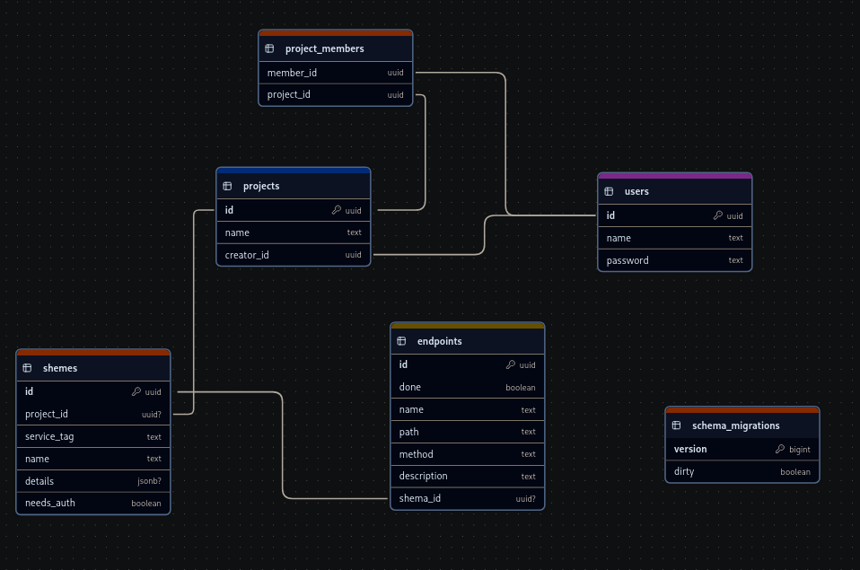

### Backend

## [RUN]
```
doas docker-compose up --build
```

## [BUILD]
```
make build
doas docker-compose up --build
```

## [DOCS]
```shell
{SERVER_ADDR}/api/v1/docs
# OR JUST:
docs/swagger.json
```


## DB SCHEME


